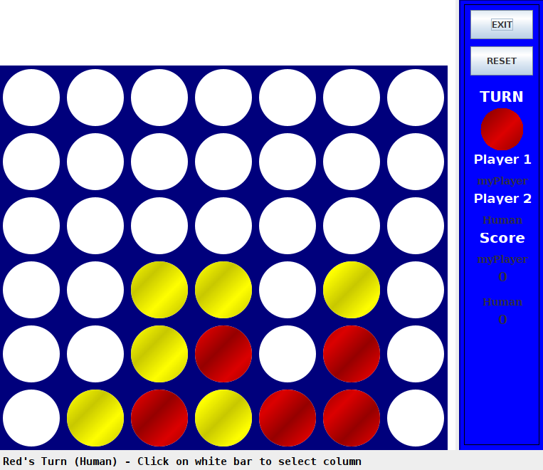

# Connect-X Solver
Algorithms and Data Structures project for uni.  

### Note:
*All next commands must be executed in the connectx/ directory.*

*Replace either L0 or L1 with myPlayer and replace M, N, X with values.*

- N = number of rows
- M = number of columns
- X = number of pieces to connect in order to win

## To compile:  

	javac -cp ".." *.java */*.java

#### If you want to see the board:

- Human vs Computer:  
	
		java -cp ".." connectx.CXGame N M X connectx.L0.L0

- Computer vs Computer:

		java -cp ".." connectx.CXGame N M X connectx.L0.L0 connectx.L1.L1

#### If you don't want to see the board:

- Output score only:

	    java -cp ".." connectx.CXPlayerTester N M X connectx.L0.L0 connectx.L1.L1

- Verbose output:

	    java -cp ".." connectx.CXPlayerTester N M X connectx.L0.L0 connectx.L1.L1 -v

- Verbose output and customized timeout (time) and number of game repetitions (rounds):

	    java -cp ".." connectx.CXPlayerTester N M X connectx.L0.L0 connectx.L1.L1 -v -t time -r rounds

# General Description
	The project focuses on the creation of an artificial player for the Connect X game.
	The main challenge is to develop an algorithm capable of selecting the best possible move at each turn of the game, taking into account previous moves and trying to maximize your own winning opportunities or minimize those of your opponent. The choice must be done in a limited amount of time.

# Concepts Used
    1. Game Tree Search: 
   	I've implemented a game tree search algorithm based on the Alpha-Beta Pruning algorithm learned in class, which allowed me to explore possible moves and evaluate them to determine the best one.
   
    2. Iterative Deepening: 
	To manage the constraint of having limited amount of time to pick the move, I've utilized another approach learned in class called Iterative Deepening, which progressively increases the depth of the search until we reach the time limit.
   
    3. Transposition Table: 
	To improve the efficiency of search and calculations, I've implemented a transposition table that stores evaluations of previously explored game states, reducing the need for recalculations.

	4. Zobrist Hashing:
	To store a game state inside the Transposition Table, I've used the Zobrist Hashing to convert each specific game state into a hash value. This allowed me not to store the whole board each time, but just a value.
   
    5. Game State Evaluation: 
	I've developed an evaluation function that assigns a score to each game state based on various characteristics, such as the presence of winning threats, opportunities to create traps for the opponent, and the presence of already formed sequences of pieces. This function guides the algorithm in choosing the move.

